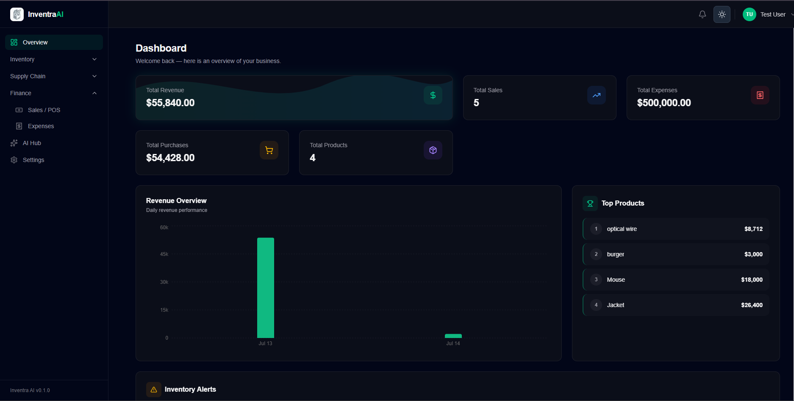

<div align="center">

  

  <br><br>

  # Inventra AI

  ### Next-Gen Smart Logistics & Inventory Platform

  

  <br>

  A full-stack, production-grade inventory management system engineered for modern retail operations. Inventra AI combines intelligent data automation, responsive glassmorphic UI, and secure multi-tenant architecture to deliver a seamless experience across desktop and mobile viewports.

  <br>

  <a href="https://inventra-ai-lac.vercel.app" target="_blank">
    
  </a>
  <a href="https://inventra-backend-mu.vercel.app/api" target="_blank">
    
  </a>

  <br>

  [](https://nextjs.org)
  [](https://react.dev)
  [](https://typescriptlang.org)
  [](https://tailwindcss.com)
  [](https://mongodb.com)
  [](https://expressjs.com)
  [](https://framer.com/motion)
  [](#)

</div>

---

## System Overview

Inventra AI is a multi-tenant SaaS inventory platform that enables shop owners and staff to manage products, suppliers, purchases, sales, expenses, and AI-powered knowledge documents through a unified dashboard. The system enforces role-based access control (Owner / Staff), per-shop data isolation, and automatic stock lifecycle management — from purchase ingestion through sale deduction and refund restoration.

**Core capabilities include:**

- **Product Lifecycle Management** — Full CRUD with automatic SKU/Barcode generation, stock tracking, low-stock alerts, and status transitions (Active → Low Stock → Out of Stock → Discontinued).
- **Transaction Engine** — Purchase and Sales workflows with line-item sub-documents, payment status tracking, tax/discount calculations, and automatic inventory synchronization.
- **AI Knowledge Base** — Document upload (PDF, DOCX, TXT, CSV) with server-side text extraction, chunking, and an AI chat interface for querying business documents.
- **Financial Reporting** — Aggregated sales, purchases, expenses, profit, and revenue reports with CSV/Excel export.
- **Multi-Channel Notifications** — Automatic alerts for low stock, out-of-stock, expiring products, and monthly sales/profit summaries.
- **Barcode & QR Generation** — Server-side barcode creation with PDF sheet printing and QR code generation per product.

---

## Tech Stack Ecosystem

| Layer | Technology | Version | Purpose |
|-------|-----------|---------|---------|
| **Frontend Framework** | Next.js (App Router) | 16.2.10 | SSR/CSR hybrid rendering, route groups, font optimization |
| **UI Library** | React | 19.2.4 | Component architecture, concurrent features |
| **Language** | TypeScript | ^5.0 | End-to-end type safety across client and form schemas |
| **Styling** | Tailwind CSS | 4.x | CSS-first configuration, utility-first design system |
| **Animation** | Framer Motion | 12.42.2 | Spring physics, staggered reveals, layout animations |
| **State** | React State + Custom Hooks | — | Local state management with 12 domain-specific hooks |
| **Forms** | React Hook Form + Zod | 7.81 / 4.4 | Schema-validated form handling with resolver pattern |
| **Auth** | Better Auth | 1.6.23 | Cookie-based sessions, HMAC-SHA256 signatures, role-based access |
| **HTTP Client** | Axios | 1.18.1 | Interceptor-driven 401 auto-refresh with request retry |
| **Charts** | Recharts | 3.9.2 | Declarative bar charts for revenue visualization |
| **Toasts** | Sonner | 2.0.7 | Non-blocking success/error notifications |
| **Icons** | Lucide React | 1.24.0 | Tree-shakeable icon library |
| **State (planned)** | Zustand | 5.0.14 | Lightweight store (available for future scaling) |

### Backend Stack (Separate Repository)

| Layer | Technology | Purpose |
|-------|-----------|---------|
| **Runtime** | Node.js + Express 5.2.1 | REST API server |
| **Database** | MongoDB + Mongoose | Document store with schema validation |
| **Auth** | Better Auth (server) | Session management, user model, custom fields |
| **Validation** | Zod (backend schemas) | Compound unique indexes (`shopId` + `barcode`) |
| **Deployment** | Vercel | Serverless backend hosting |

---

## Core Architectural Highlights

### Intelligent Data Flows — Collision-Free SKU & Barcode Generation

The system implements a deterministic timestamp-and-hash algorithm to generate globally unique product identifiers:

```
SKU Pattern:    INV-{timestamp}-{5-char-alphanumeric}
Barcode Pattern: BAR-{timestamp}-{4-char-alphanumeric}
```

Each identifier combines `Date.now()` (millisecond precision) with a cryptographically random string via `Math.random().toString(36)`, ensuring collision-free generation even under high-concurrency creation flows. The backend enforces compound unique indexes (`shopId` + `sku`, `shopId` + `barcode`) as a secondary safety net.

- **Client-side auto-generation** fills empty barcode/SKU fields on form submission.
- **Server-side generation** via dedicated `/barcodes/generate/:productId` endpoint for post-creation assignment.
- **PDF sheet generation** for bulk barcode and QR code printing.

### Mobile-First Viewports — Adaptive Layout System

The application implements a structural dual-layout architecture:

- **Desktop (>768px):** Fixed 256px sidebar with collapsible navigation groups, sticky blurred navbar, and full-width data tables with sortable columns.
- **Mobile (<768px):** Floating glassmorphic navbar with hamburger toggle, slide-from-left drawer sidebar (Framer Motion `AnimatePresence`), and intelligent transformation of complex nested data tables into stacked card layouts.

Every data entity (products, categories, suppliers, purchases, sales, expenses) renders with a **dual rendering pattern** — a full HTML table on desktop and responsive data cards on mobile — ensuring no information density is lost on smaller viewports.

The bento grid dashboard uses responsive breakpoints (`grid-cols-1 → sm:grid-cols-2 → md:grid-cols-3`) with staggered Framer Motion reveals for progressive content loading.

### State & Auth Integrity — Secure Session Architecture

The authentication layer leverages Better Auth with a custom configuration:

- **Cookie-based sessions** with HMAC-SHA256 signed tokens (`better-auth.session_token`).
- **Role-based access control** with custom `role` field (`owner` / `staff`) and `shopId` for multi-tenant data isolation.
- **Middleware chain:** `requireAuth` → `requireShopAccess` / `requireOwner` / `requireOnboarding` — enforcing authorization at every API endpoint.
- **Axios interceptor** implements automatic 401 detection, session refresh via `authClient.getSession()`, and transparent request retry — preventing stale-token UX disruptions.
- **Dashboard layout guard** performs a three-way redirect: no session → landing, no shop → onboarding, authenticated → dashboard.

### Light/Dark Mode Engine

A custom `ThemeProvider` built on `useSyncExternalStore` provides zero-cost-render dark mode toggling:

- Persists preference to `localStorage` under `inventraai_theme`.
- Anti-FOUC (Flash of Unstyled Content) script injected in root `<head>` reads stored preference and applies `.dark` class before React hydration.
- CSS custom properties (`--background`, `--foreground`) drive all color tokens.
- Tailwind v4 class-based dark mode via `@variant dark (&:where(.dark, .dark *))`.

---

## Feature Matrix

| Feature | Status | Details |
|---------|--------|---------|
| Multi-tenant shops | Complete | Per-shop data isolation, soft-delete |
| Role-based access | Complete | Owner / Staff with middleware enforcement |
| Product management | Complete | CRUD, pagination, status tracking, search |
| Category management | Complete | Color-coded, icon-based categorization |
| Supplier management | Complete | Full CRUD with trade license tracking |
| Purchase orders | Complete | Line items, payment status, tax/discount |
| Sales transactions | Complete | Auto stock deduction, refund restoration |
| Expense tracking | Complete | Categorized with receipt image support |
| Barcode generation | Complete | Auto-generation + PDF sheet printing |
| QR code generation | Complete | Per-product QR with PDF sheet output |
| Dashboard analytics | Complete | Revenue charts, top products, inventory alerts |
| AI knowledge base | Complete | Document upload, text extraction, AI chat |
| Notifications | Complete | Low stock, expiring, monthly summaries |
| Light/Dark mode | Complete | Persistent with anti-FOUC protection |
| Mobile responsive | Complete | Drawer sidebar, card-based data views |
| CSV/Excel export | Complete | Sales, purchases, inventory, expenses |
| Import (CSV/Excel) | Complete | Products, categories, suppliers |
| Shop settings | Complete | Profile, currency, timezone, invoice prefix |

---

## Live Deployment

| Service | URL | Description |
|---------|-----|-------------|
| **Frontend** | [inventra-ai-lac.vercel.app](https://inventra-ai-lac.vercel.app) | Next.js 16 production build on Vercel |
| **Backend API** | [inventra-backend-mu.vercel.app/api](https://inventra-backend-mu.vercel.app/api) | Express 5 + MongoDB REST API |

---

## Local Development Guide

### Prerequisites

- **Node.js** ≥ 18.0.0
- **npm** ≥ 9.0.0 (or yarn / pnpm / bun)
- **MongoDB** instance (local or Atlas)
- Backend server running ([backend repo](https://inventra-backend-mu.vercel.app))

### 1. Clone the Repository

```bash
git clone https://github.com/codeHasib/inventraAI
cd inventraai_frontend
```

### 2. Install Dependencies

```bash
npm install
```

### 3. Configure Environment Variables

Create a `.env.local` file in the project root:

```env
# Backend API URL (client-exposed)
NEXT_PUBLIC_API_URL=https://inventra-backend-mu.vercel.app/api

# Backend base URL (client-exposed)
NEXT_PUBLIC_BACKEND_URL=https://inventra-backend-mu.vercel.app

# Better Auth CORS origin (server-only)
BETTER_AUTH_URL=https://inventra-ai-lac.vercel.app
```

> For local backend development, replace the URLs above with `http://localhost:5000/api` and `http://localhost:5000` respectively.

### 4. Start Development Server

```bash
npm run dev
```

Open [http://localhost:3000](http://localhost:3000) in your browser, or visit the [live demo](https://inventra-ai-lac.vercel.app).

### 5. Build for Production

```bash
npm run build
npm start
```

---

## Project Structure

```
src/
├── app/                        # Next.js App Router (route groups)
│   ├── (landing)/              # Public landing page
│   ├── (auth)/                 # Login & Register (split-screen layout)
│   ├── (onboard)/              # Shop onboarding wizard
│   └── (dashboard)/            # Authenticated dashboard
│       ├── dashboard/          # Main dashboard with analytics
│       ├── products/           # Product management
│       ├── categories/         # Category management
│       ├── suppliers/          # Supplier management
│       ├── purchases/          # Purchase orders
│       ├── sales/              # Sales transactions
│       ├── expenses/           # Expense tracking
│       ├── barcodes/           # Barcode & QR generation
│       ├── ai-knowledge/       # AI document chat
│       └── settings/           # Shop profile settings
├── components/                 # 47 reusable components
│   ├── ui/                     # Design system primitives
│   ├── dashboard/              # Dashboard-specific components
│   ├── products/               # Product CRUD components
│   ├── categories/             # Category CRUD components
│   ├── suppliers/              # Supplier CRUD components
│   ├── purchases/              # Purchase form & table
│   ├── sales/                  # Sale form & table
│   ├── expenses/               # Expense form & table
│   ├── knowledge/              # AI chat & document manager
│   └── settings/               # Profile form
├── hooks/                      # 12 domain-specific custom hooks
├── lib/                        # Utilities, auth client, animations
├── store/                      # Zustand store (available for scaling)
└── types/                      # 13 TypeScript type definition files
```

---

## API Integration

The frontend communicates with the backend through a centralized Axios instance (`src/lib/axios.ts`) configured with:

- **Base URL** from `NEXT_PUBLIC_API_URL` environment variable.
- **Request interceptor** for automatic credential inclusion.
- **Response interceptor** for 401 detection, session refresh, and request retry.
- **Error extraction** from the backend's standard `{ success, statusCode, message, data }` response shape.

All 12 custom hooks (`src/hooks/`) encapsulate API calls with consistent patterns:
- `items`, `loading`, `error` state management.
- AbortController for request cancellation on unmount.
- Post-mutation `refetch()` for data freshness.
- Toast notifications via Sonner for user feedback.

---

<div align="center">

  <a href="https://inventra-ai-lac.vercel.app" target="_blank">
    
  </a>
  &nbsp;&nbsp;
  <a href="https://inventra-backend-mu.vercel.app/api" target="_blank">
    
  </a>

  <br><br>

  **Built with precision. Designed for scale. Engineered for production.**

  <sub>Made with Next.js 16 &middot; React 19 &middot; Tailwind CSS 4 &middot; Framer Motion &middot; Better Auth &middot; MongoDB</sub>

</div>
